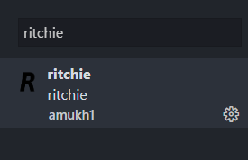

[](https://www.npmjs.com/package/Ritchie)

# Ritchie

> A small *compiled* **programming language** similar to *C*.

<br>

> Contact me for help, because I *will* respond. Discord: amukh1#9613

## Prerequisites

This project requires NodeJS (version 8 or later) and NPM.
[Node](http://nodejs.org/) and [NPM](https://npmjs.org/) are really easy to install.
To make sure you have them available on your machine,
try running the following command.

```sh
$ npm -v && node -v
6.4.1
v8.16.0
```

## Getting Started

These instructions will get you a copy of the project up and running on your local machine for development and testing purposes. See deployment for notes on how to deploy the project on a live system.

## Installation
<br>

**BEFORE YOU INSTALL:** please read the [prerequisites](#prerequisites)

<br>

To install and set up the library, run:

```sh
$ npm install ritchie
```

Or if you prefer using Yarn:

```sh
$ yarn add --dev ritchie
```

## There is also a vscode extension:
**[Extension Link](https://marketplace.visualstudio.com/items?itemName=amukh1.ritchie)**

**Or  just search up "Ritchie" in the extensions section**



## Usage

august-lang takes 2 file extentions, .aug and .asm.
<br>

rcomp is the compiler.. (*R*itchie *Comp*iler) and putting in an .rit file compiles it to a .asm file.

```sh
$ rcomp ./file.rit name
```
ASM compiles to bytecode automatically on Linux (if your on Windows/OSX use an online compiler).
[Web Compiler](https://www.jdoodle.com/compile-assembler-nasm-online/)

## Example program:
<br>

```
import Stdio

function _start() {
println("hi", 2)
SYS::EXIT
}

SYS::DATA
```
## Wanna learn more? check out the docs: [Visit docs](https://ritchie.js.org/docs)

<!-- <style>
.docs {
    transition: all 0.5s ease;
    position: relative;
    top: 0px;
    background-color:#0f38f0; 
    border-radius:25px; 
    color: white; 
    padding:25px;
    border: none;
}

.docs:Hover {
    top: -10px;
    background-color: #0009a8;
        /* color: white;  */
}

.a {
      text-decoration: none;
    color: white;
    font-size: 2rem;
}

</style> -->

<!-- <button class="docs" href="/handbook/toc/" style="" onClick="()=>{alert('Missed the link?')}">
<a class="a" href="https://ritchie.js.org/docs/">Visit Docs</a>
</button> -->


<br>

## Contributing

You can contribute to the project by making a pull request on [GitHub](https://github.com/amukh1/Ritchie).

## Credits

### Amukh1.

## Built With

* [Node](https://nodejs.org/)
* [Assembly](http://x86asm.net/)
* [Love](https://amukh1.dev)

## Authors

* **Amukh1** - [Github](https://github.com/amukh1)

See also the list of [contributors](https://github.com/amukh1/Ritchie/contributors) who participated in this project.

## License

[MIT License](https://mit-license.org/2022) © Amukh1